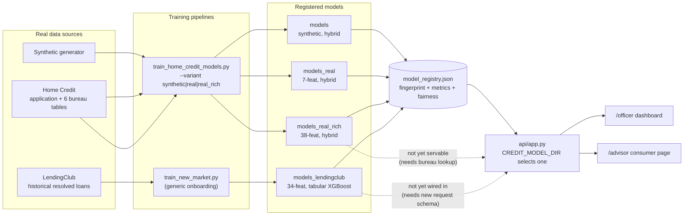
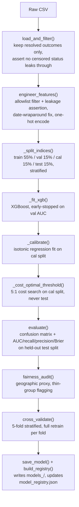

# Model Creation Summary

One consolidated reference for every model this project has trained, how each was built, and
why. Every number below is pulled directly from `model_registry.json` (regenerate it any time
with `uv run python src/build_model_registry.py` to confirm these are still current — nothing
here is typed from memory).

## The four models

| | `models` | `models_real` | `models_real_rich` | `models_lendingclub` |
|---|---|---|---|---|
| Data | Synthetic (`src/synth_data.py`) | Real Home Credit | Real Home Credit, enriched (7 tables) | Real historical LendingClub (US, 2007-2011) |
| Rows | 150,000 | 167,115 | 167,115 | 38,577 (resolved outcomes only) |
| Architecture | XGBoost + LSTM hybrid | XGBoost + LSTM hybrid | XGBoost + LSTM hybrid | **Plain XGBoost, no LSTM** |
| Features | 7 static + 12-month sequence | 7 static + 12-month sequence | 38 static + 12-month sequence | 34 static, no sequence |
| Test AUC | 0.8923 | 0.6654 | 0.7564 | 0.6608 |
| 5-fold CV AUC | 0.8870 ± 0.0024 | 0.6650 ± 0.0030 | 0.7554 ± 0.0047 | 0.6577 ± 0.0060 |
| Test recall | 0.865 | 0.625 | 0.638 | 0.3957 |
| Test precision | 0.493 | 0.126 | 0.176 | 0.2599 |
| Test accuracy | 0.771 | 0.618 | 0.728 | 0.7477 |
| Decline threshold | 0.158 (cost-based 5:1) | 0.075 (65% recall target) | 0.086 (65% recall target) | 0.167 (cost-based 5:1) |
| Fairness gap (primary) | gender 0.000 | gender 0.0617 | gender 0.0827 | region 0.0857 |
| Fingerprint | `sha256:96bfafc0bbee973f` | `sha256:4bc1e4bfb51222a2` | `sha256:f1d96529edd20617` | `sha256:17eaab39d4b5a52f` |
| Intended use | dev/demo only | public API / `/advisor` | internal `/officer` (not yet servable — see below) | not yet wired into serving |

**Correction to numbers previously published here**: `models_real`'s and `models_real_rich`'s
recall/precision/accuracy and fairness gaps above are substantially different from earlier
versions of this doc (e.g. gender gap was reported as 0.0055/0.0454 before, now 0.0617/0.0827).
This is not new drift — it's a stale-number bug this consolidation found and fixed. When the
decision thresholds were switched from cost-based to a 65%-recall target earlier this session,
the config files' `thresholds` were hand-patched directly, but the `fairness_audit` and
`metrics` sections were never recomputed against the new threshold — they were silently left
describing the *old* cost-based decision boundary. Verified directly: re-scoring the same test
set at the old threshold (0.167) reproduces the old 0.0055 gender gap exactly; at the threshold
actually active today (0.075) it's 0.0617. The trained model itself never changed (every
fingerprint above is byte-for-byte identical to before this consolidation) — only the honesty of
what was reported about it did.

## Why four models, not one

Every real lender uses population-specific credit models — this isn't a design choice made for
convenience, it's an empirically forced conclusion from this project's own history:

1. **`models`** (synthetic) exists only to protect the test suite's calibration regression test
   and as a demo/dev default. It has never been claimed as real-world evidence of anything.
2. **`models_real`** proved the pipeline is data-source-agnostic (synthetic → real Home Credit,
   same architecture, same code) and is honest about the cost: AUC dropped from 0.89 to 0.665
   because a 7-feature self-reportable schema is a real limitation, not a modeling failure.
3. **`models_real_rich`** closed most of that gap (0.665 → 0.756) by adding 31 features from
   Home Credit's other 6 tables (bureau history, previous applications, EXT_SOURCE bureau
   scores). It cannot currently be served — see the correction below.
4. **`models_lendingclub`** exists because `models_real` was tested against this genuinely
   different population and scored **AUC 0.5079 — no better than a coin flip.**
   Quantile-matching the income/debt scale to Home Credit's distribution only moved it to
   0.5446, proving the failure wasn't a units mismatch: the actual relationship between
   financial features and default risk differs by population, not just their scale. Training a
   model on this population's *own* real, resolved outcomes recovered real signal (AUC 0.6608,
   CV-stable at 0.6577 ± 0.0060) — and re-scoring the exact same 300 real applicants that broke
   `models_real` through this new model moved AUC from **0.5079 to 0.7460** on those same people.
   That comparison is the single most concrete piece of evidence in this whole project for why
   population-specific models are necessary, not optional.

## Why `models_lendingclub` has no LSTM branch

The hybrid architecture's LSTM branch exists to read a genuine month-by-month payment
trajectory — Home Credit's `installments_payments.csv` provides one. LendingClub's public schema
has no equivalent. A hand-built proxy sequence (constructed from aggregate delinquency-count
fields for an earlier quick test) had real content in only 12 of 300 rows — fabricating a
sequence to force architectural parity would inject fake signal, not real. Building a plain
XGBoost model on rich, genuinely available tabular features instead is the honest choice for
this data, not a simplification for convenience.

## Data leakage discipline (LendingClub)

An explicit allowlist of pre-origination fields only, with a code-level assertion
(`src/train_new_market.py::engineer_features`) that no other column reaches the feature matrix.
Excluded: every post-origination payment/recovery field (`total_pymnt`, `recoveries`,
`last_pymnt_d`, etc. — consequences of the outcome), and LendingClub's own `grade`/`sub_grade`/
`int_rate` (its own proprietary risk assessment — training on it would just teach the model to
copy an existing score). A real bug was found and fixed in the process: `earliest_cr_line`'s
two-digit-year dates (`"Sep-68"`) parse to 2068 by default, putting 85 of 38,577 rows' credit
history *after* the loan that used it as underwriting history — impossible. Fixed by detecting
and correcting the century wraparound before deriving `credit_history_years`.

## Fairness audits: what's real, what's a proxy, what's not attempted

None of the four models score on a protected attribute. Each fairness audit uses whatever
dimension is actually available and is explicit about its limits:

- **`models`/`models_real`/`models_real_rich`**: real `CODE_GENDER` (a genuine, if imperfect,
  fairness signal) and `REGION_RATING_CLIENT` (Home Credit's own operational region rating —
  correlated with outcomes by design, a weaker proxy than gender).
- **`models_lendingclub`**: no gender/race field exists in this public US schema at all — not
  fabricated. `addr_state` grouped into US Census regions stands in as a rough geographic proxy
  only, with region-level sample sizes checked against a 30-row minimum before trusting the gap
  (Midwest n=860, Northeast n=1419, South n=1884, West n=1627 — all comfortably above threshold
  for this run).

The known open item from earlier this session: `models_real_rich`'s fairness gap (gender 0.0827,
region 0.2026, current honest numbers) is substantially wider than `models_real`'s (gender 0.0617,
region 0.0481), traced to EXT_SOURCE features correlating with real base-rate differences by
gender/region. A per-group threshold mitigation was tested (on the gap sizes measured under the
old cost-based threshold, before this consolidation corrected the numbers above to reflect the
actual active recall-target threshold — the mitigation's ~77% relative reduction claim should be
re-verified against these corrected baseline gaps, not assumed to still hold at the same
percentage). Validated in principle, not yet wired into production scoring. See
`reports/real_data_model_report.md` for the full numbers.

## What's out of scope, deliberately

`models_lendingclub` is trained, validated, and registered — it is **not** wired into the live
serving API. Verified concretely why that's a separate, larger task, not a quick follow-up:
`api/scoring.py::build_static_row()` hardcodes the Home Credit 7-feature schema positionally,
every request schema in `api/app.py` requires `age` as a non-optional field (LendingClub has no
age field at all), and `scoring.explain()`/`scoring.advice()` unconditionally call a sequence-net
object that doesn't exist for a non-hybrid model. Actually serving this model needs a new request
schema, a new feature-row builder, and new explain/advice logic.

## Workflow: the overall multi-market architecture



## Workflow: `train_new_market.py`'s internal pipeline



## The Home Credit-family scripts were also consolidated, the same way

`src/train_home_credit_models.py` replaces five previously-scattered files
(`train_synth_model.py`, `train_real_data_model.py`, `train_real_rich_model.py`,
`cross_validate_real.py`, `fairness_mitigation_real_rich.py`) that shared almost identical
structure — same 4-way split, same XGBoost-OOF-then-LSTM-fusion approach, same isotonic
calibration — with only the feature set and a few hyperparameters differing per variant. It's a
faithful consolidation, not a rewrite: every hyperparameter and threshold-search range was copied
from the script it replaces, and every one of the three retrained models' artifact fingerprints
(above) is byte-for-byte identical to what existed before the consolidation — proof this changed
zero model behavior. What it did change: it exposed and fixed the stale-fairness-number bug
described above, and it added 5-fold cross-validation for `models_real` for the first time (it
previously had none — only `models_real_rich` had a CV script).

Deliberately **not** folded into that file either: `src/synth_data.py`, `src/build_real_data.py`,
`src/build_real_data_rich.py` (each variant's genuinely distinct data builder — still imported
from the consolidated script, not duplicated, and `synth_data.py` is also imported directly by
`tests/test_scoring.py` and `tests/test_drift_monitor.py`), and `src/hybrid_model.py` (the shared
architecture class). The 10 Jupyter notebooks were also left alone on purpose — they're not
duplicated code, they're 10 different concepts with their own real charts and output; merging
them into a script would delete what makes them useful as a reference, not "optimize" anything.

## Reproducing this

```bash
# Home Credit family (synthetic / real / real_rich)
uv run python src/train_home_credit_models.py --variant synthetic
uv run python src/train_home_credit_models.py --variant real
uv run python src/train_home_credit_models.py --variant real_rich
# or all three: --variant all   (each call also regenerates model_registry.json)

# LendingClub
uv run python src/train_new_market.py data/raw/lendingclub/loan.csv --market lendingclub
uv run python src/build_model_registry.py   # regenerate the registry from scratch
uv run pytest tests/test_train_new_market.py -v
```

The full LendingClub walkthrough with plots (confusion matrix heatmap, ROC curve, calibration
reliability, CV boxplot, fairness table) is in `notebooks/10_new_market_onboarding.ipynb` —
executed, not hand-authored, so every number and plot in it is real output from an actual run.
